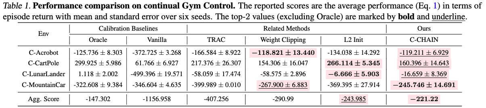
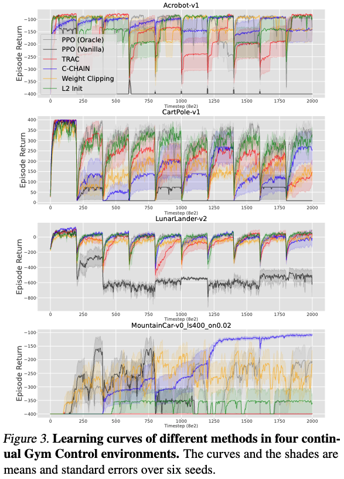
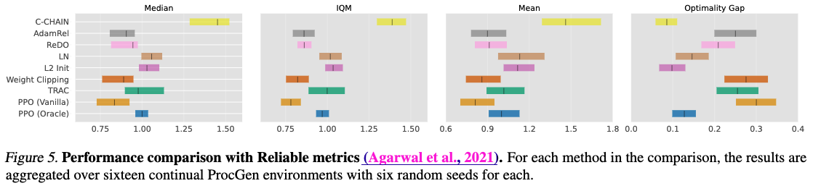
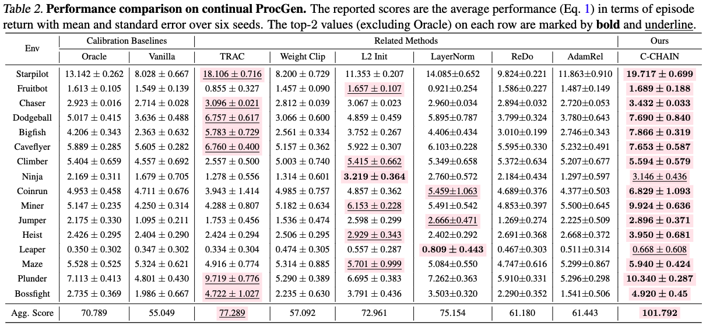
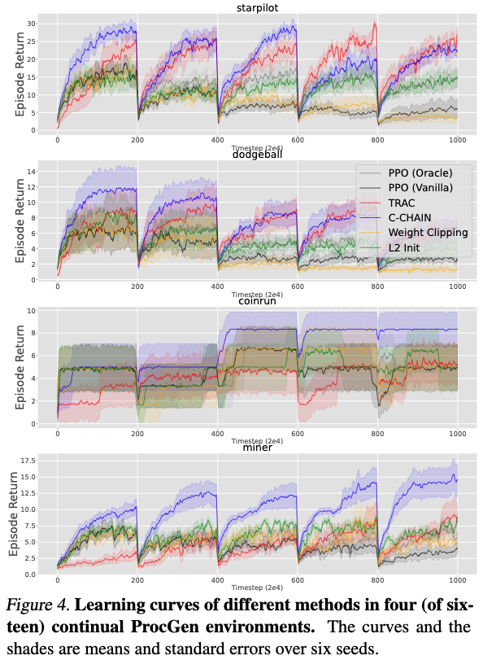
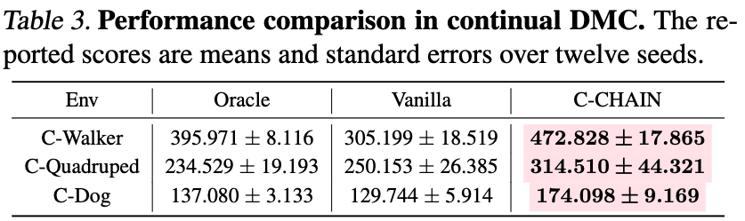
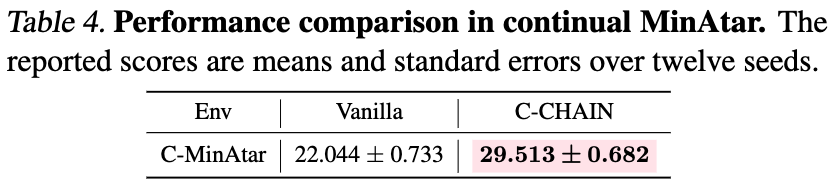
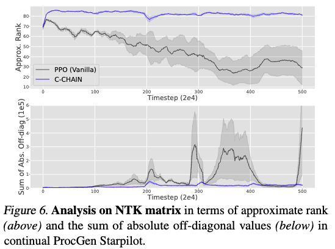
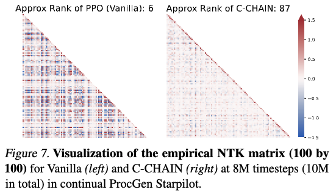
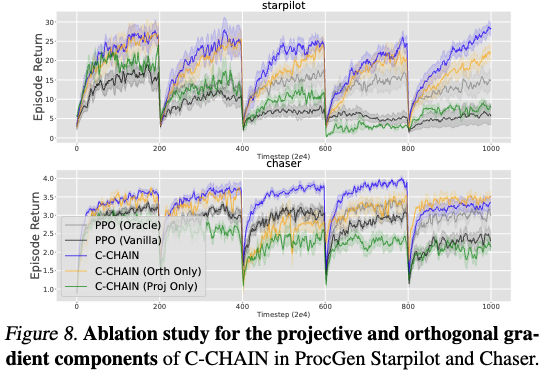

# C-CHAIN: Continual Churn Approximated Reduction


The code implementation of Continual Churn Approximated Reduction (C-CHAIN) for ICML 2025 paper "Mitigating Plasticity Loss in Continual Reinforcement Learning by Reducing Churn"


Please refer to our [paper](https://openreview.net/pdf?id=EkoFXfSauv) and [project page](https://bluecontra.github.io/C-CHAIN/) for more details.


## Running Environment Setups:

Since our codes are written upon existing code bases (e.g., **Continual Gym Control/ProcGen** from [TRAC](https://github.com/ComputationalRobotics/TRAC), **DMC Suite** from CleanRL, and **MinAtar**), one can run our code by following the installation of corresponding environments.
Then download our code and put into the running script folder.

We also provide the Dockerfile we used in ```./dockerfiles``` for reference. In practice, we mainly run with Apptainer (by building docker images first and converting them to Apptainer images).

For all our code implementations, we implement based on the corresponding code base with a slight re-organization of code structure (e.g., from single-file implementation to a bit modular). 
One can run the baseline method to verify the environment setups and then compare the scripts for the baseline method and its C-CHAIN version to see the difference.


### Continual Gym Classic Control & Continual ProcGen

For our experiments on Continual Gym Classic Control, we implement based on the original code provided in the official repo https://github.com/ComputationalRobotics/TRAC.
We recommend to follow the installation guidance and then run our code provided in ```./crl_gym_classic_control``` and ```./crl_procgen```, respectively.

We recommend to follow the installation guidance and then run our code provided in .

### Continual DMC
Continual DMC is an experimental environment for continual RL built by us. It contains three CRL settings, each of which chains the corresponding individual tasks in a sequence, as shown below:
- Continual Walker: Stand-Walk-Run
- Continual Quadruped: Walk-Run-Walk
- Continual Dog: Stand-Walk-Run-Trot

For our experiments on Continual DMC, we implement based on the original code provided in the official repo https://github.com/vwxyzjn/cleanrl.
We recommend to follow the installation guidance of DMC env in CleanRL and then run our code provided in ```./crl_dmc```.
We also provide the Dockerfile we used in practice, which can be found in ```./dockerfiles.cleanrl_dmc```.


### Continual MinAtar
Continual MinAtar is an experimental environment for continual RL built by us, by chaining three MinAtar tasks: SpaceInvaders, Asterix, Seaques.
For our experiments on Continual MinAtar, we implement based on the original code provided in the official repo https://github.com/kenjyoung/MinAtar.
We recommend to follow the installation guidance of MinAtar env and then run our code provided in ```./crl_minatar```.


## Results

### Comparative Evaluation of C-CHAIN @ Continual Gym Classic Control

<p align="center">
  
</p>
<p align="center">
  
</p>

### Comparative Evaluation of C-CHAIN @ Continual ProGen

<p align="center">
  
</p>
<p align="center">
  
</p>
<p align="center">
  
</p>

### Comparative Evaluation of C-CHAIN @ Continual DMC

<p align="center">
  
</p>

### Comparative Evaluation of C-CHAIN @ Continual DMC

<p align="center">
  
</p>

### Empirical NTK Analysis for C-CHAIN v.s. Vanilla

<p align="center">
  
</p>
<p align="center">
  
</p>

### Gradient Analysis of C-CHAIN

<p align="center">
  
</p>

Please refer to our [paper](https://openreview.net/pdf?id=EkoFXfSauv) for complete results.


## Citation

```
@inproceedings{
  htang2024mitigating,
  title={Mitigating Plasticity Loss in Continual Reinforcement Learning by Reducing Churn},
  author={Hongyao Tang and Johan Obando-Ceron and Pablo Samuel Castro and Aaron Courville and Glen Berseth},
  booktitle={International Conference on Machine Learning},
  year={2025},
  url={https://openreview.net/pdf?id=EkoFXfSauv}
}
```